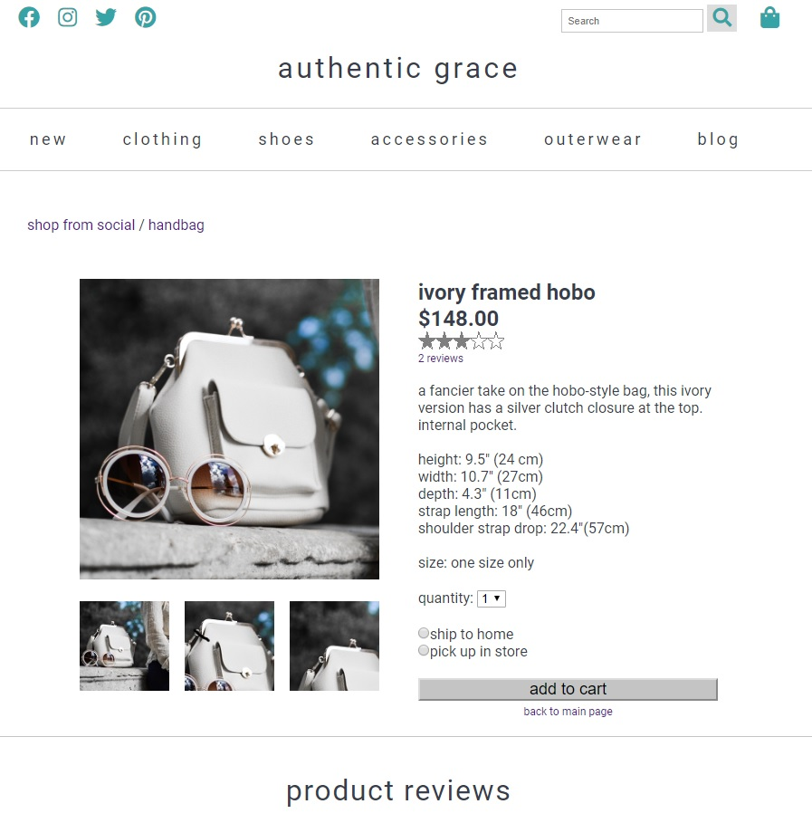

# Authentic Grace Phase 2

View on Netlify: [Authentic Grace Front End Website - Phase 2](link)

## About the Project

Authentic Grace is a fictional brick-and-mortar clothing store in need of a website to increase visibility, establish an online presence, and display products.  The front-end of the website was built collaboratively by [Racquel Tung](https://racqcancode.github.io/portfolio-WIP) and [Amy McGowan](https://amymcgowan.dev) as the product of an assigment during Cohort 4 of [The Moms Can: Code School](https://www.momscan.co/).

## Project Guidelines

In version, 1.0, the goal of the project was to design and develop an MVP for a website for the client, Authentic Grace.  In this version, 2.0.  We were to add a product page that linked directly from our original website while making the website more accessible.

_Required Project Features_
* Create an Accessible Website
* Create a Shopping Item Details page
* Unobtrusive file structure
* Links
* No code comments are present
* Project coded using HTML5 and CSS3 plus Javascript
* Code structure is readible
* Website is deployed

## Project Partial Screenshot

## Project Wireframe

The website wireframe in Figma, which can be viewed [here](https://www.figma.com/file/pqkXOmtQ4aI7D2edEtuTqc/Authentic-Grace-1.0---Racquel?node-id=0%3A1).

## Contact

Racquel Tung
* Portfolio: [https://racqcancode.github.io/portfolio-WIP](https://racqcancode.github.io/portfolio-WIP)
* Github: [racqcancode](https://github.com/racqcancode)
* Twitter: [@racqcancode](https://twitter.com/racqcancode)